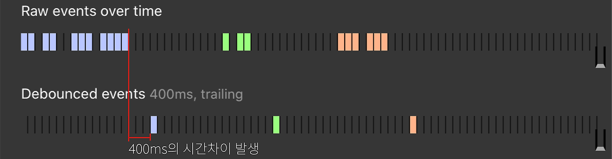
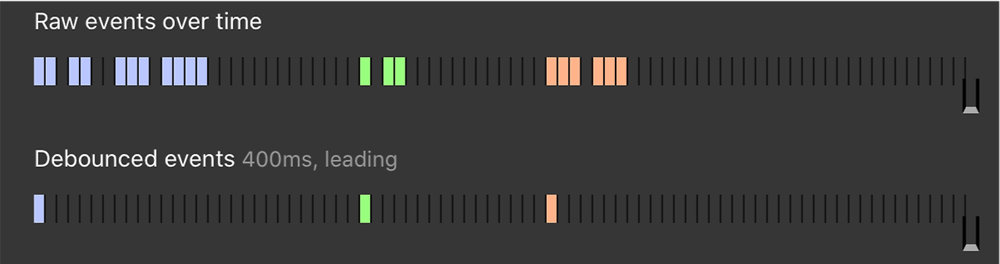
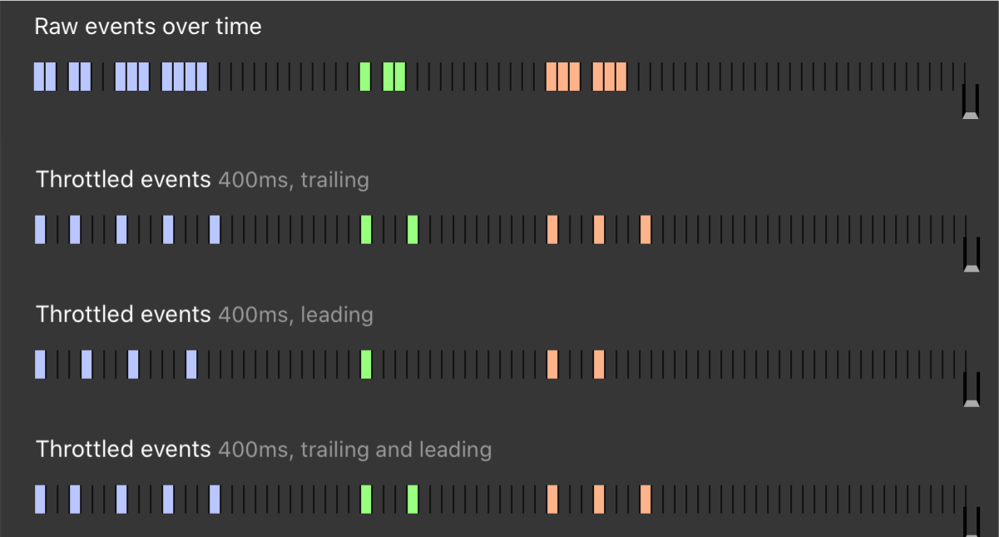

## 1. Debounce
`Debounce`는 연속적으로 발생하는 이벤트를 그룹화하여 이벤트가 1번만 실행하도록 하는 기술이다.  
이벤트가 발생하면 타이머를 설정하고, 타이머가 끝나기 전에 이벤트가 발생하면 타이머가 0초부터 다시 시작한다.  

## 1.1 Trailing Debounce
`Trailing Debounce`는 연속적인 이벤트들 중 마지막 이벤트만 실행하도록 하는 방식이다.

그림과 같이 연속적인 이벤트들 중 마지막 이벤트를 선택하며 타이머가 끝났을 때 이벤트가 실행된다.

## 1.2 Leading Debounce
`Leading Debounce`는 연속적인 이벤트들 중 첫번째 이벤트만 실행하도록 하는 방식이다.

그림과 같이 처음 이벤트가 발생하면 즉시 실행되며 이후 타이머를 이용하여 이벤트가 실행되지 않도록 한다.

## 1.3 Debounce Hook 구현
다음은 입력 이벤트를 받아 Trailing Debounce를 구현한 Hook이다.
```ts
interface debounceProps<T> {
  value: T;
  delay: number;
}

function useDebounce<T>({ value, delay }: debounceProps<T>): T {
  const [debouncedValue, setDebouncedValue] = useState(value);

  useEffect(() => {
    // 타이머 이후 마지막 value를 선택(Trailing Debounce)
    const handler = setTimeout(() => {
      setDebouncedValue(value);
    }, delay);

    // value가 변경 되면 타이머를 초기화
    return () => {
      clearTimeout(handler);
    };
  }, [value]);

  return debouncedValue;
}
```

## 2. Throttle
`Throttle`은 한번 실행되면 일정 시간 동안 다시 실행되지 않도록 하는 기술이다.  
즉, 일정 시간 간격에서 최대 1번만 이벤트가 실행되도록 한다.



위 그림과 같이 어떤 이벤트가 발생하면 구간이 시작되며 해당 구간에서는 이벤트가 최대 1번만 실행된다.

## 2.1 Throttle Hook 구현

```ts
interface throttleProps<T> {
  callback: () => void;
  delay: number;
}

// 제어하고자 하는 핸들러를 callback으로 받아 throttle을 구현
function useThrottle({ callback, delay }: throttleProps<T>): void {
  const lastRun = useRef(Date.now());

  return () => {
    const timeElapsed = Date.now() - lastRun.current;
    // 간격이후 발생한 이벤트만 실행
    if(timeElapsed >= delay) {
      callback();
      lastRun.current = Date.now();
    }
  }
}
```

## 3. Debounce와 Throttle의 차이점
- `Debounce`는 연속적인 이벤트를 최종적으로 1번만 실행되도록 한다.
- `Throttle`은 연속적인 이벤트를 일정 시간 동안 주기적으로 실행되도록 한다.

### 3.1 언제 무엇을 사용해야 할까?

Debounce
- `Resize` 이벤트 : 사용자의 창 크기 조절을 멈출 때까지 기다렸다가 최종 크기에 대해서만 처리하는 경우
- `Input` 이벤트 : 사용자의 입력이 끝날 때까지 기다렸다가 처리하는 경우
- 비용이 많이 드는 작업 : 주기적으로 요청하는 것 또한 비용이 부담되는 경우

Throttle
- `Scroll` 이벤트 : 사용자의 스크롤에 따라 이벤트를 발생시키는 경우(무한 스크롤)