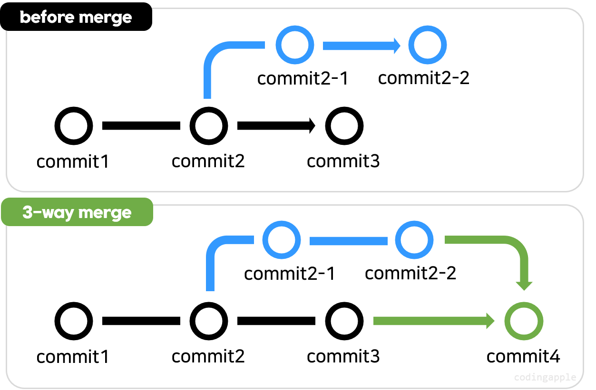
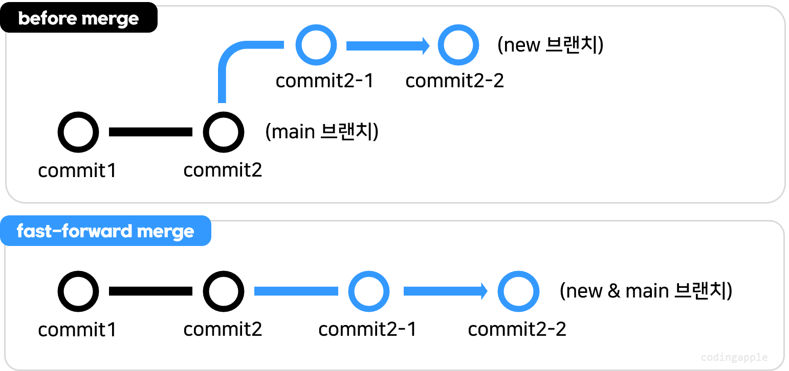
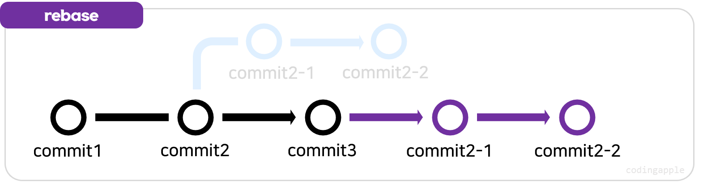
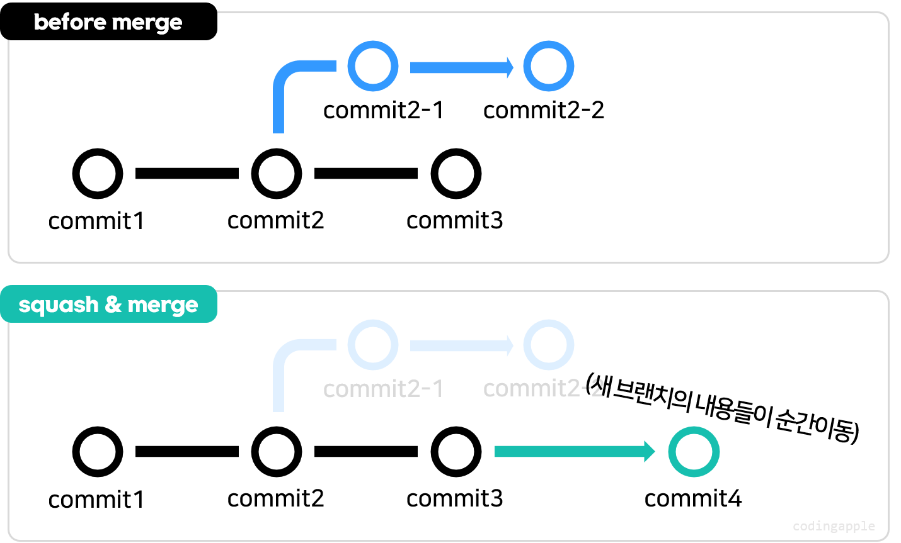

## 1. 3-way merge

`3-way merge`는 두 브랜치의 코드를 합친 새로운 커밋을 생성하여 병합한다.  
`target` 브랜치에 커밋이 1개 이상 있을 때 기본적으로 동작하는 방식이다.


## 2. fast-forward merge

`fast-forward merge`는 `source` 브랜치를 `target` 브랜치의 앞에 일직선으로 붙이는 방식이다.  
`target` 브랜치에 커밋이 없을 때 기본적으로 동작하는 방식이다.

다음과 같은 명령어로 강제 `3-way merge`를 수행하도록 할 수도 있다.
```bash
git merge --no-ff
```

## 3. rebase and merge

`rebase`를 한 이후 `merge`를 수행하는 방식이다. `rebase`이후에는 `fast-forward merge` 또는 `3-way merge`로 병합하여 커밋 기록을 깔끔하게 유지할 수 있다.

```bash
git switch new-branch
git rebase main

git switch main
git merge new-branch
```

## 4. squash merge

`squash merge`는 `source` 브랜치의 모든 커밋을 하나로 합쳐서 `target` 브랜치에 새로운 커밋으로 추가하는 방식이다.  

```bash
git switch main
git merge --squash new-branch
git commit -m 'message'
```

또는 `rebase -i`를 통해 `commit`을 합치는 과정(squash)만 수행할 수도 있다.
```bash
# 최근 3개의 커밋을 합치기
git rebase -i HEAD~3
```